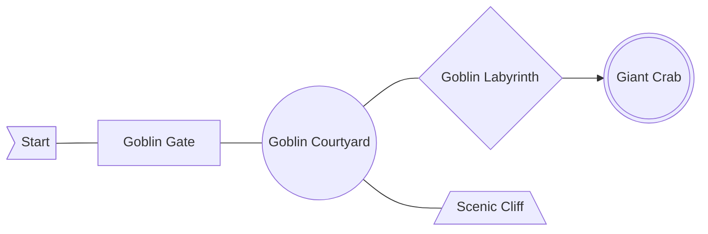

# River Belle Path

> They say that wicked creatures prowl the road along this beautiful riverbank, but nobody has ever seen one.
>
> I once asked a man why.
>
> He simply replied, "Because anybody who happens upon one is promptly eaten!"
>
> But it is long since anyone has met such a fate.
>
> For nowadays, people take another route,
> far away from the spooky old road.
>
> Only we walk the old way now...
>
> travelers in crystal caravans.

**Goal** Defeat the _Giant Crab_ protecting the Myrrh Tree.

## Monster List

Normally this would have multiple encounter lists for which year it is or which visit number this is. Since this is an introductory version of the book, we're going to assume its the first visit on the first year.

<section class="monster-list" markdown>

**Goblin** 3 Hearts  
Combat 2, Unity 1, Magic 1  
_Resistant to_ -  
_Vulnerable to_ Fire, Lightning  
Appears in groups of 3 to 4.

**Goblin Chieftan** 24 Hearts  
Combat 2, Unity 2, Magic 1  
_Resistant to_ -  
_Vulnerable to_ Fire  
Provides other Goblins an extra dice on all rolls.  
Unity: Other Goblins get +1 to their stats this turn.

**Mu** 10 Hearts  
Combat 2, Unity 1, Magic 2  
_Resistant to_ -  
_Vulnerable to_ Fire, Ice  
Able to cast Thunder.  
May drop Thunder Magicite upon defeat.

**Hedgehog Pie** 12 Hearts  
Combat 2, Unity 1, Magic 2  
_Resistant to_ -  
_Vulnerable to_ Ice, Lightning  
Able to cast Fire.  
May drop Fire Magicite upon defeat.

</section>

!!! Tip "May drop upon defeat."

    Ultimately this is up to your Game Master. A nice way of handling it might be someone rolling Luck after the fight.

    If you do this, only one person should probably roll. It makes it more exciting.

## Entrance

The Caravan finds itself unable to move itself any further. The players will have to continue on foot. The Goblins that live here have destroyed the ground and dried it out. Its craggly and difficult to even walk on. Maybe one day this trade route will heal.

The Entrance is always a plain Exploration Area.

**_Exits_**

-   Goblin Gate

## Goblin Gate

The Goblins have setup a defense here. A large gate made out of fallen trees. The Miasma has dried them out and made them hard as stone. A quick glance can tell that it has mechanisms behind it allow it to open when a stone tablet key is put into the pedestal nearby.

If this is a Combat area, spawn some goblins in and around the wall. Goblins can throw rocks and swing swords.

If this is a Puzzle area, the gate is locked and the key has been hidden somewhere inconvenient. Probably hanging off the top of the gate where only a polearm can reach it.

If this would be an Exploration area when the type is rolled, it becomes a Puzzle area instead.

**_Exits_**

-   Goblin Courtyard

## Goblin Courtyard

The ground here is softer, tamped by goblins walking on it every day. The only hint of green grows on the very edges where the ground meets cliffs. Another gate is here.

If this would be a Combat area, spawn some Goblins and a Chieftan.

If this would be a Puzzle area, the door is locked. Theres a treasure box.  
It requires a Fire Spell (or some creativity) to open. It has the key.

If this would be an Exploration area, theres a gravel beach next to the river.  
The players may change the element of their Chalice to Wind or Water while they're here.

**_Exits_**

-   Goblin Labyrinth
-   The Scenic Gauntlet

## The Scenic Cliff

A surprisingly long path through a beautiful piece of forest up a small hill. The Myrrh tree's roots must have reached this place. The pathway ends at a cliff overlooking the Goblin Labyrinth.

If this is a Combat, spawn a Mu and a Hedgehog Pie.  
They're trying to destroy the forest. Its not going well for them.

If this is a Puzzle, there are trip wires hooked up to bells in the area below.

If this is an Exploration, the air smells cleaner than normal. Players may spend an action to put a Myrrh Leaf in an Accessory slot. You may expend the Myrhh Leaf to clear a status effect.

**_Exits_**

-   Goblin Courtyard
-   Drop into the Goblin Labyrinth

## Defeat The Giant Crab

Giant crab stuff
